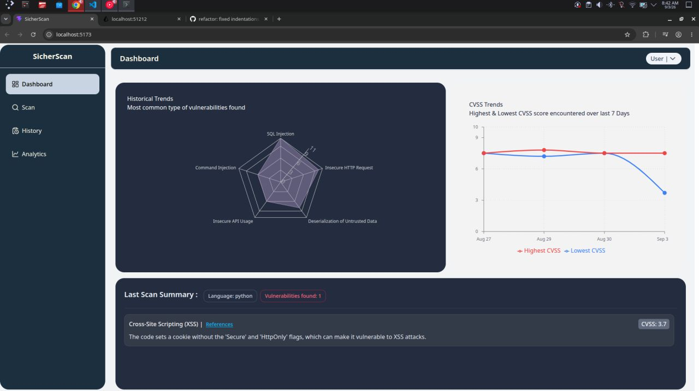
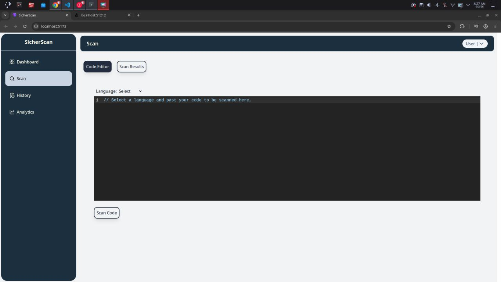
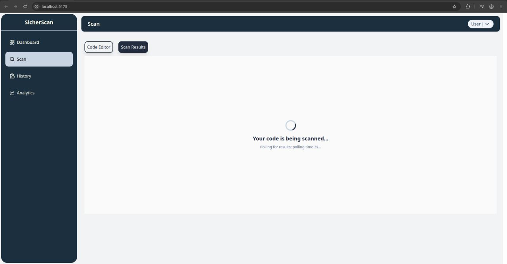
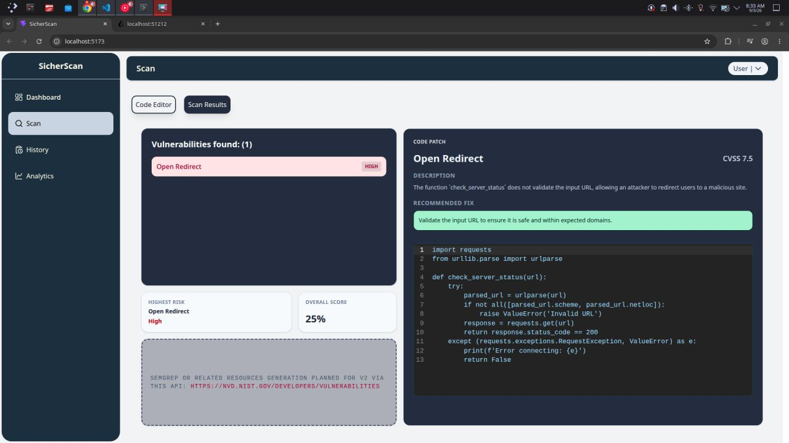
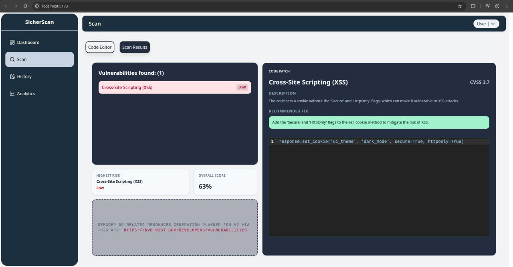
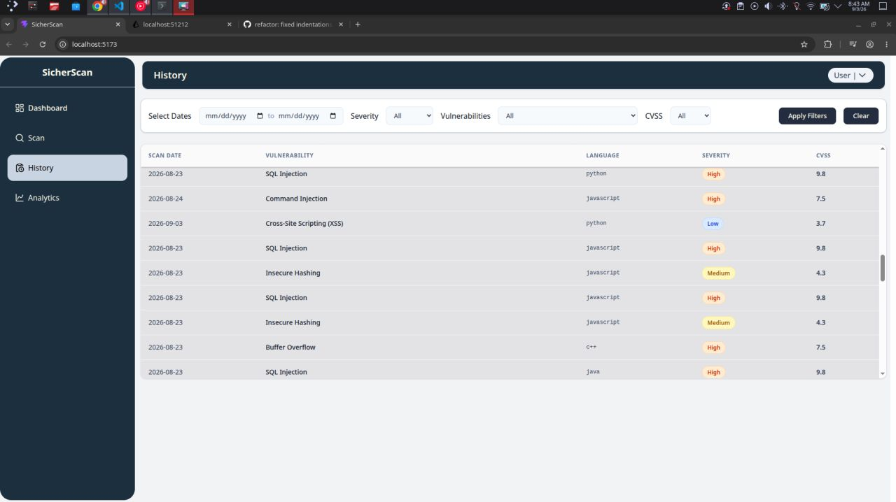
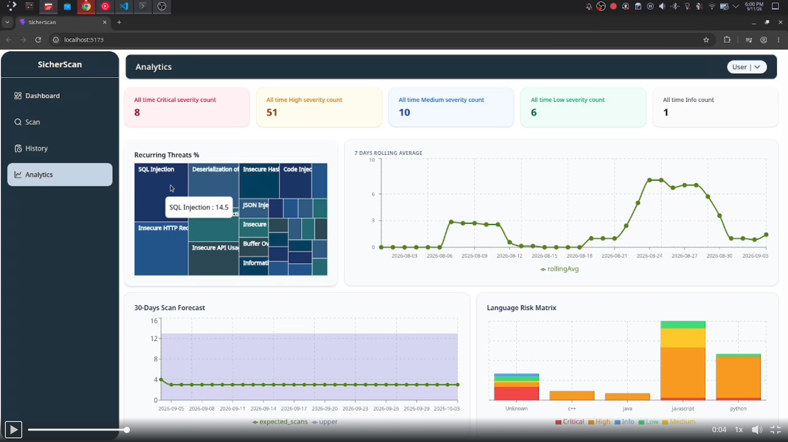
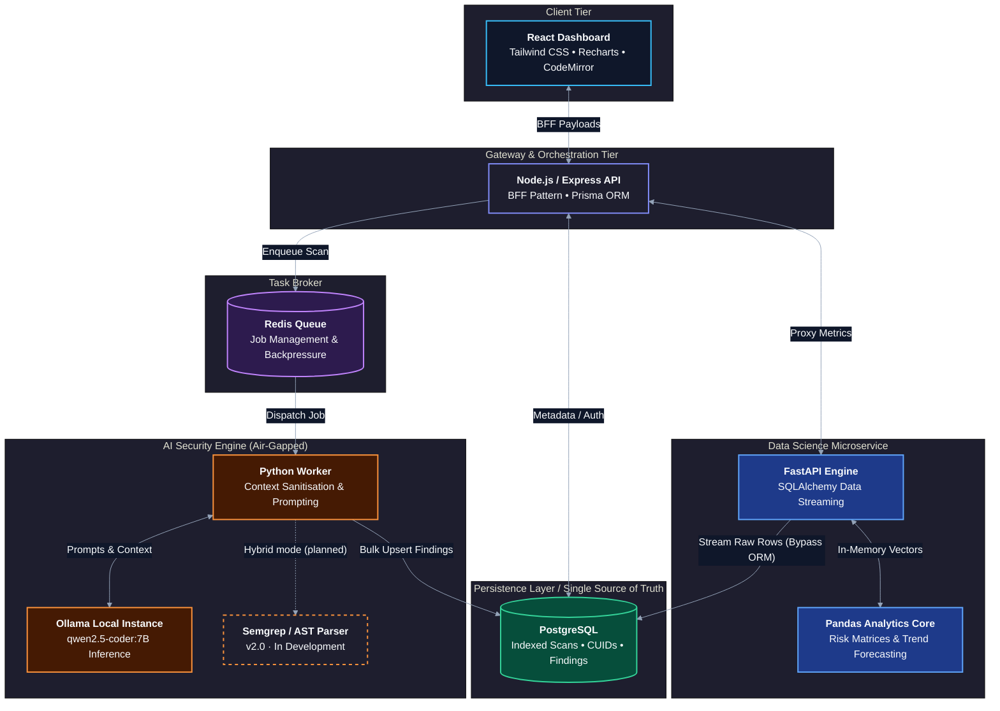

# SicherScan
> **Air-Gapped, Local-First SAST & AI Security Engine**

An on-premise static application security testing (SAST) platform that uses a local quantized LLM (`qwen2.5-coder:7B` via Ollama) for vulnerability auditing and automated remediation, so source code never has to leave your infrastructure.

> **About this repository**
> This is a **demo repository**. It contains the architecture, screenshots, a sample finding and a walkthrough of SicherScan. **The source code is private.** I'm happy to walk through the codebase and design decisions in an interview or on a call.
>
> **Demo video:** [Watch the walkthrough](https://lnkd.in/p/dQCes5BX) &nbsp;|&nbsp; **LinkedIn:** [Ajinkya Bhede](https://www.linkedin.com/in/ajinkyabhede/)

**Current status:** `v1.5`: LLM-only scanning mode is live. `v2.0` (hybrid AST + LLM pipeline) is in development.
*Last updated: October 2026*

---

## Screenshots

### Dashboard
<p align="center">
  
</p>

### Code Editor
<p align="center">
  
</p>

### Scan Results
<p align="center">
  
  
  
</p>

### History
<p align="center">
  
</p>

### Analytics
<p align="center">
  
</p>

---

## System Architecture



### Tech Stack

| Layer | Technologies |
|---|---|
| Frontend | React, Tailwind CSS, Recharts, CodeMirror |
| Gateway API | Node.js, Express, Prisma ORM |
| AI Security Worker | Python (standalone processing engine) |
| Analytics Microservice | Python, FastAPI, Pandas, SQLAlchemy |
| Local AI Engine | Ollama (`qwen2.5-coder:7B`; any local LLM can be used, depending on your preference and hardware) |
| Database | PostgreSQL |
| Queue | Redis |

---

## Core Engineering Highlights

- **Air-Gapped by Design:** Runs fully on-premise with no external API dependencies. Source code, prompts and findings stay on your own hardware, which makes SicherScan a fit for proprietary, regulated and security sensitive codebases.
- **No Source Code Sent to External APIs:** All analysis and remediation generation happens through a local model, so no code is shared with third-party LLM providers.
- **Asynchronous Queue Architecture:** Redis and isolated Python workers decouple the Node.js gateway from heavy LLM inference, preventing event-loop starvation.
- **Isolated Data Science Pipeline:** A FastAPI microservice streams raw PostgreSQL rows into Pandas DataFrames for risk matrices, rolling averages and ARIMA forecasting, bypassing ORM serialisation bottlenecks.
- **Independently Scalable Tiers:** The API gateway, Redis queue and workers are decoupled, so each can be scaled on its own. More powerful hardware (GPU, RAM) lets you load larger models for better detection reliability.

## Features

- **Local LLM vulnerability detection and remediation:** Detects vulnerabilities and generates suggested fixes with a local `qwen2.5-coder:7B` model. LLM-only mode is live in `v1.5`.
- **Backend-for-Frontend (BFF) approach:** Data transformations and calculations are mostly handled on the Node.js server, which delivers pre-computed, optimised payloads to the React UI for fast rendering.
- **Async service organisation:** Redis and isolated Python workers manage long-running LLM tasks without blocking the main Node.js event loop.
- **Interactive dashboard:** Severity and risk charts (line, radar and more), an in-browser CodeMirror editor, and an interactive Treemap that surfaces recurring vulnerability patterns.
- **Analytics engine:** A standalone Python/FastAPI microservice that uses Pandas and SQLAlchemy to feed raw database rows into DataFrames for language-risk matrices, 7-day rolling averages and ARIMA forecasting of near-term computational needs.
- **Scalable relational persistence:** PostgreSQL with Prisma ORM, using optimised indexes, CUID keys for bulk vulnerability inserts and cascading deletes to maintain strict data integrity.

---

## Sample Finding

**Vulnerability:** `SQL Injection` &nbsp;|&nbsp; **Severity:** `Critical` &nbsp;|&nbsp; **CVSS:** `9.8` &nbsp;

**Code Snippet:**
```python
query = f"SELECT id, username, role FROM users WHERE username = '{username}' AND password = '{password}'"
cursor.execute(query)
```

**Model explanation:**
> The code uses string formatting to construct SQL queries, which allows an attacker to inject arbitrary SQL syntax. Also store hashed passwords

**Suggested remediation:**
```python
query = 'SELECT id, username, role FROM users WHERE username = ? AND password = ?'
cursor.execute(query, (username, password))
```

---

## Limitations

- **Model accuracy:** A quantized 7B model can miss vulnerabilities and flag false positives. Findings should be reviewed by a human and are not a replacement for a manual security audit.
- **Context limits:** Large files and long call chains can exceed the model's context window, which may reduce detection quality.
- **Hardware dependent:** Inference speed and reliability depend on available CPU/GPU and RAM. Larger local models generally give better results.
- **Language coverage:** `C, C++, C#, Go, Java, JavaScript, JSX, Ruby, Rust, Python, PHP, Scala, Swift, Terraform, JSON`.
- **No AST validation yet:** In `v1.5` findings come from the LLM only. Hybrid AST validation is currently in development for `v2.0`.

---

## Roadmap

### Phase 1.1: Core AI Sandbox & Persistence (`v1.1`)
- [x] Initialised PostgreSQL schema with optimised indexing for Users, Projects, Scans and Vulnerabilities.
- [x] Set up isolated Python worker engine for LLM code processing.
- [x] Integrated local Ollama API calls for vulnerability detection and automated remediation generation.

### Phase 1.2: Gateway API, Queues & Frontend Dashboard (`v1.1`)
- [x] Built the Node.js/Express API gateway, with Prisma ORM handling database access.
- [x] Integrated Redis for asynchronous task management between Node and the Python worker.
- [x] Constructed React UI with Tailwind grid systems and CodeMirror editor integration.
- [x] Implemented BFF architectural pattern to serve pre-calculated UI payloads.
- [x] Built interactive charts (line, radar, etc.) for immediate vulnerability severity breakdowns on the main dashboard.

### Phase 1.3: Advanced Data Analytics Engine (`v1.5`)
- [x] Designed and developed the Python analytics engine.
- [x] Integrated SQLAlchemy and Pandas to read raw database tables into in-memory DataFrames.
- [x] Calculated Project Health Indexes, language risk matrices and advanced vulnerability aggregations.
- [x] Exposed analytics via FastAPI endpoints proxied through the Node.js gateway.

### Phase 1.4: Time-Series Forecasting & Polish (`v1.5`)
- [x] Implemented 7-day rolling averages, ARIMA forecasting and predictive security velocity using Pandas time-series indexing.
- [x] Added interactive Treemap to identify recurring vulnerability patterns.
- [x] Added error bounds for context overruns and model timeouts in the AI worker.
- [x] Finalised async stream loading indicators for live scan results.

### Phase 2.0: Hybrid Pipeline (`v2.0`) — *In development*
- [ ] Add Semgrep-based AST parsing to the worker.
- [ ] Combine AST findings with LLM analysis in a hybrid pipeline to improve accuracy and reduce false positives.

---

## Contact

Built by **Ajinkya Bhede**. Questions, feedback or a code walkthrough request are welcome.
[LinkedIn](https://www.linkedin.com/in/ajinkyabhede/) &nbsp;|&nbsp; Email: ajinkyabhede@gmail.com
